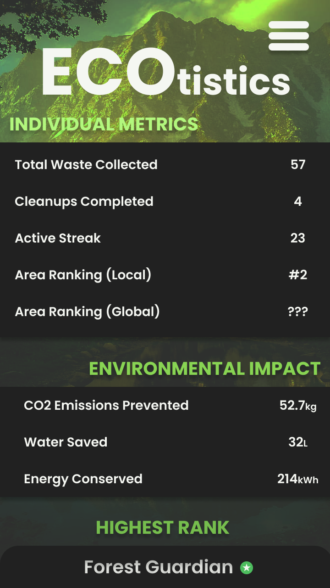

# SagBot: High-Fidelity Wireframe

  

    <h3>Login</h3>
    
  

  

    <h3>Sign Up</h3>
    
  

  

    <h3>EcoBoard</h3>
    
  

  

    <h3>EcoProfile</h3>
    
  

  

    <h3>Ecotistics</h3>
    
  

  

    <h3>EcoLocate</h3>
    
  

  

    <h3>TrashScan</h3>
    
  

  

    <h3>EcoExchange</h3>
    
  

  

    <h3>EcoProfile</h3>
    
  

