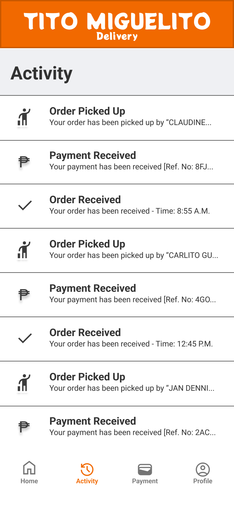
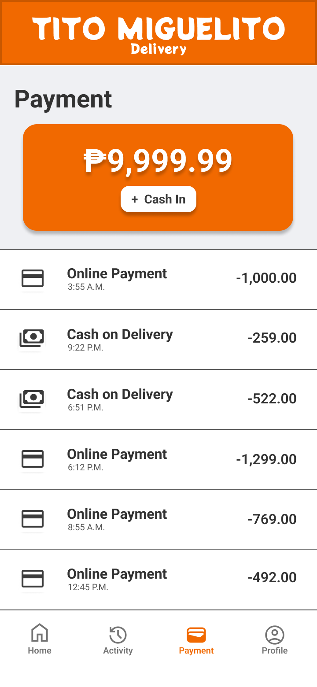
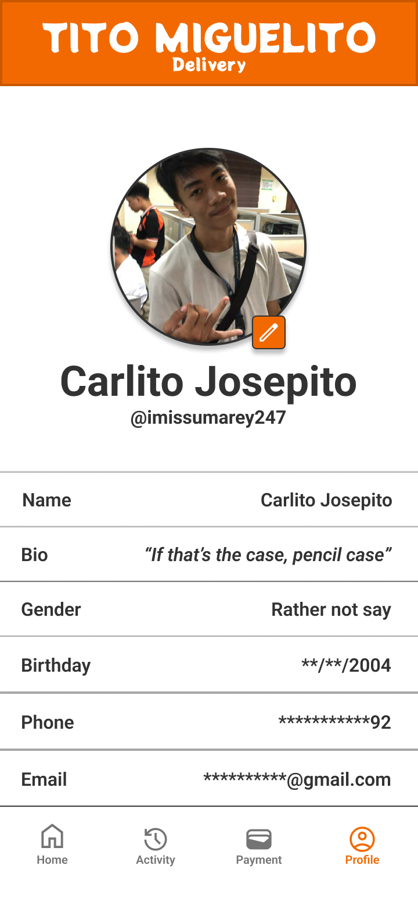

# SagBot: High-Fidelity Wireframe

  

    <h3>Activity</h3>
    
  

  

    <h3>Dashboard</h3>
    
  

  

    <h3>Messages</h3>
    
  

  

    <h3>Payment</h3>
    
  

  

    <h3>Profile</h3>
    
  

